<!-- ================= FONTS ================= -->
<link rel="preconnect" href="https://fonts.googleapis.com">
<link rel="preconnect" href="https://fonts.gstatic.com" crossorigin>
<link href="https://fonts.googleapis.com/css2?family=Inter:wght@300;400;600;900&display=swap" rel="stylesheet">

<!-- ================= LIBRARIES ================= -->

<link rel="stylesheet" href="https://cdn.jsdelivr.net/npm/swiper@11/swiper-bundle.min.css"/>

<!-- ================= ABOUT ================= -->
<section id="about">
  

  <h1>3D Modeler for Game Worlds</h1>
  

    Low–mid poly Roblox specialist.  
    Blender & Substance Painter pipeline.  
    Worked on Mow ur Snow, Shatter Isles, and more.
  

</section>

<!-- ================= CUBED ================= -->
<section id="cubed">
  <h2>▣ 3D Cubed Characters</h2>

  

    

      

        

          
        

      

      

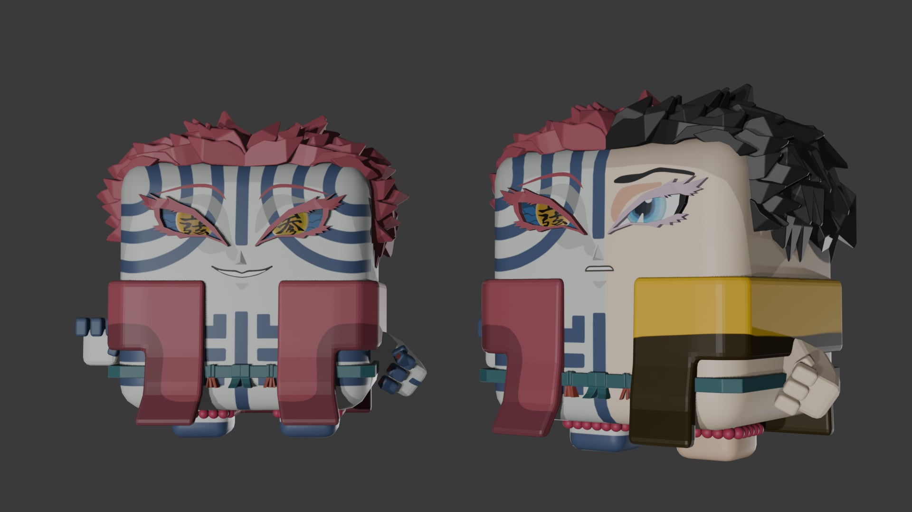

      

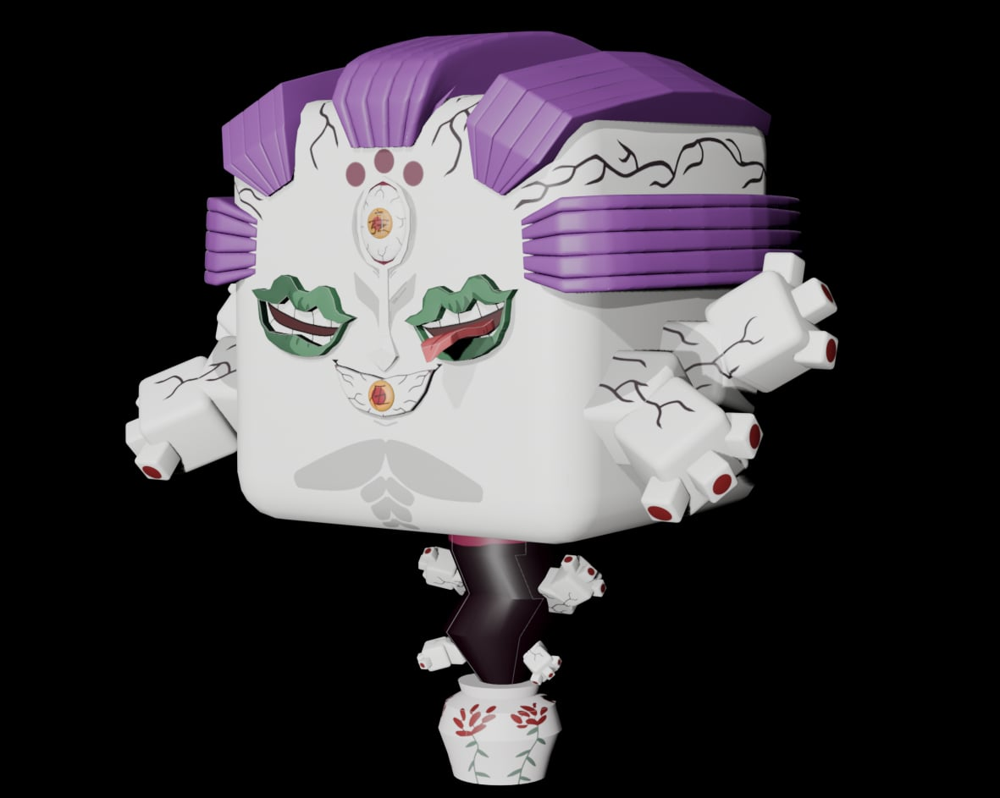

      

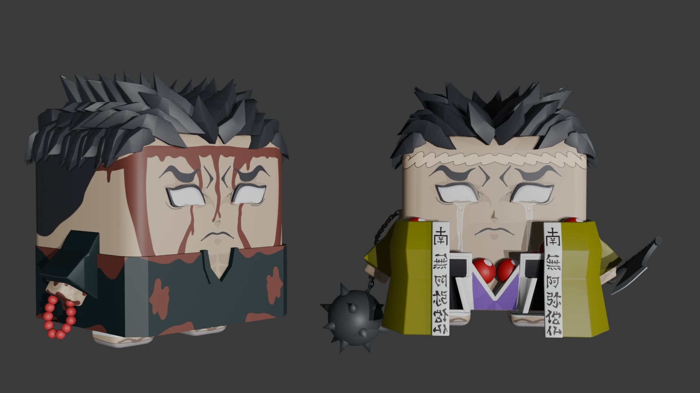

      

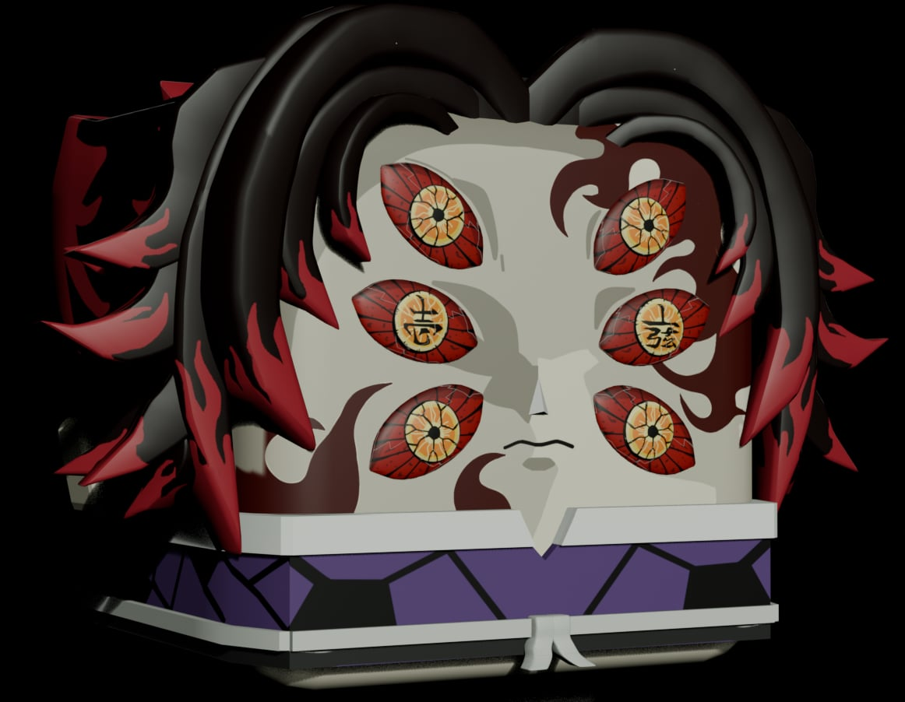

      

      

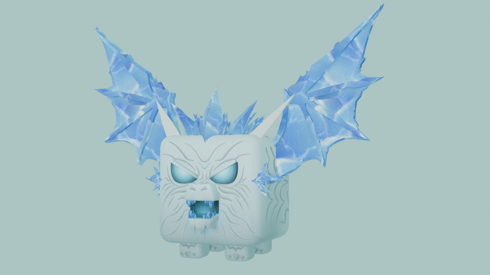

      

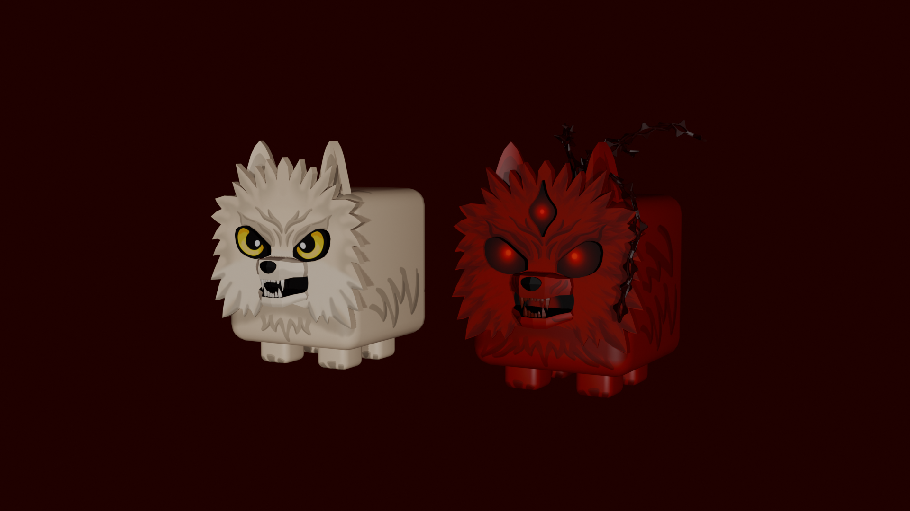

      

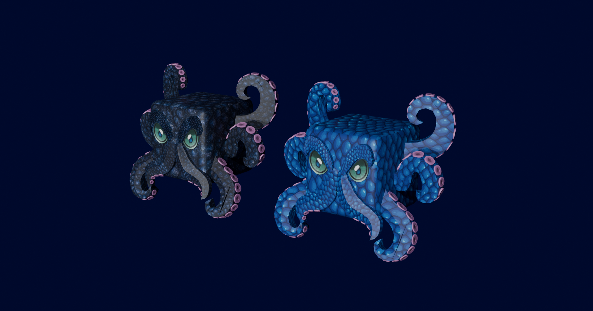

    

  

</section>

<!-- ================= MOBS ================= -->
<section id="mobs">
  <h2>◈ Mob & Boss Designs</h2>

  

    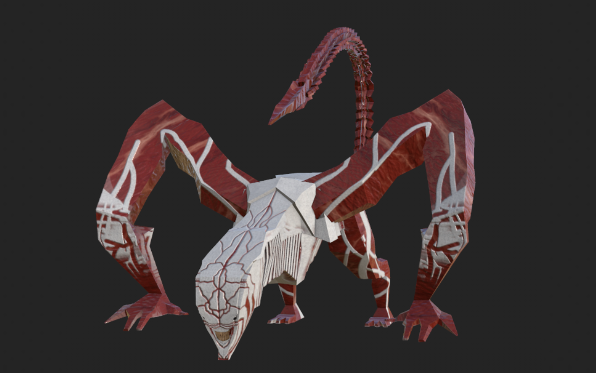
  

</section>

<!-- ================= BUILDINGS ================= -->
<section id="buildings">
  <h2>▦ Building Assets</h2>

  

    

    

    

  

</section>

<!-- ================= BIKES ================= -->
<section id="bikes">
  <h2>▧ Motorcycles</h2>

  

    

      

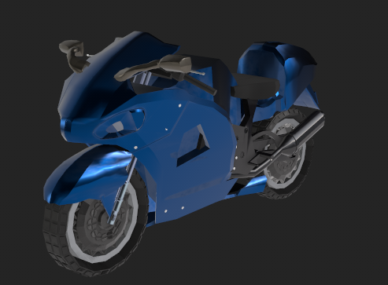

      

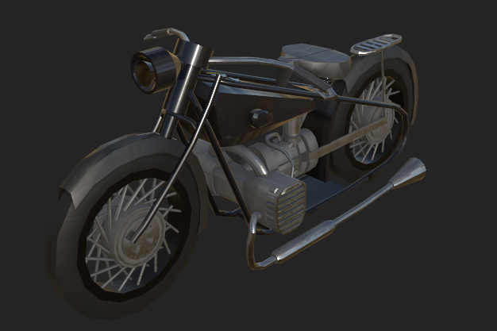

      

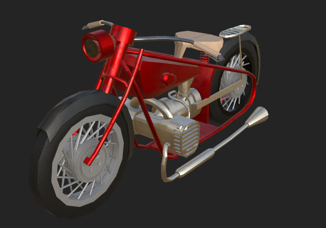

      

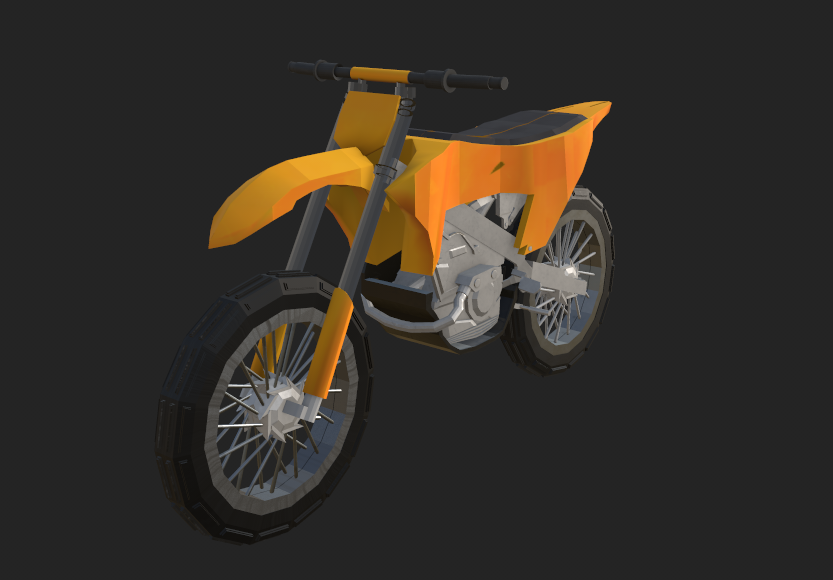

    

  

</section>

<!-- ================= BLADES ================= -->
<section id="blades">
  <h2>⟁ Blades</h2>

  

    
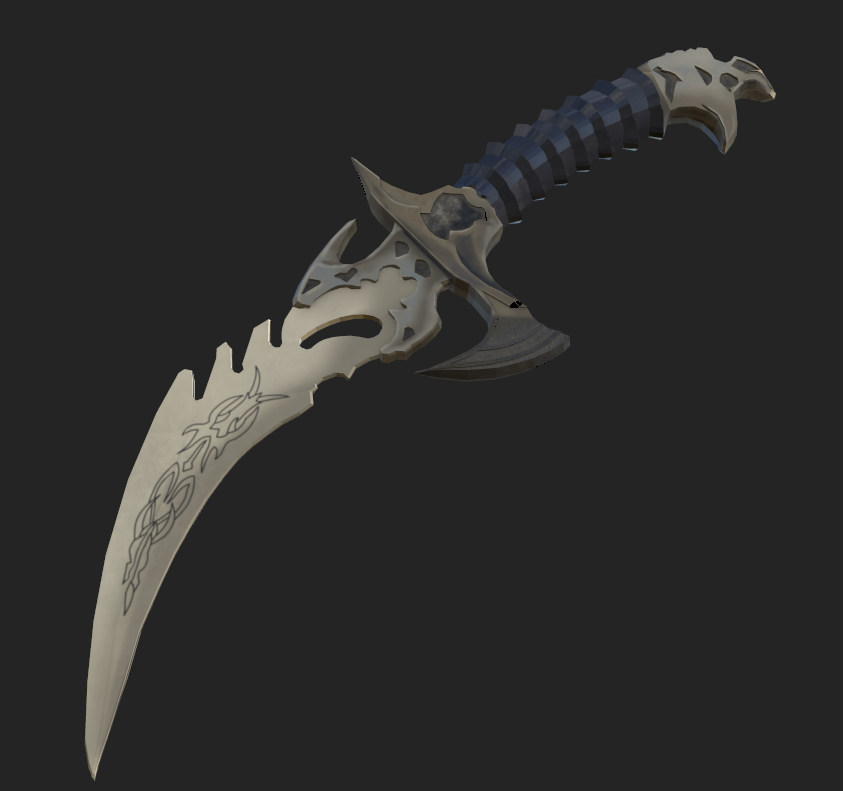

    
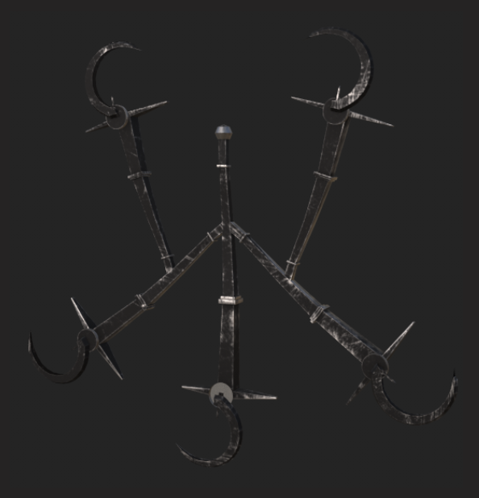

    

    
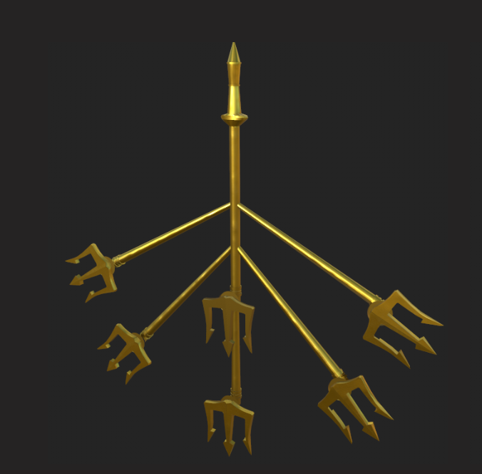

  

</section>

<!-- ================= CONTACT ================= -->
<section id="contact">
  <h2>Get In Touch</h2>
  <button onclick="navigator.clipboard.writeText('your@email.com')">Copy Email</button>
</section>

